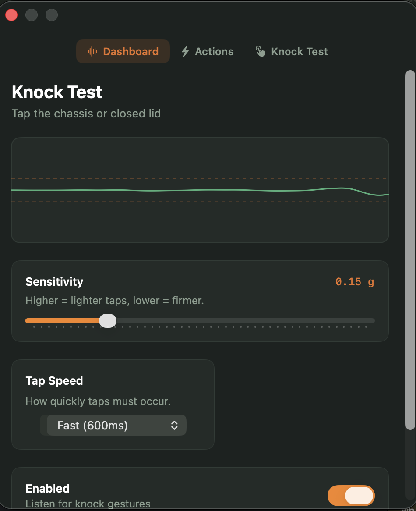
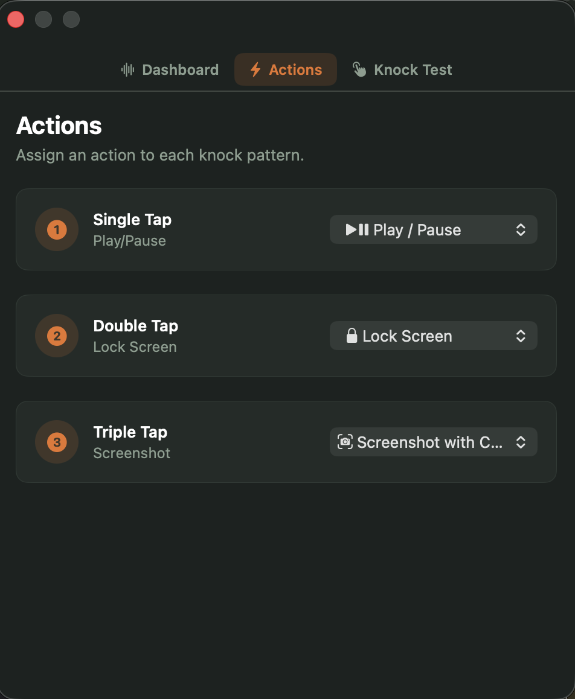
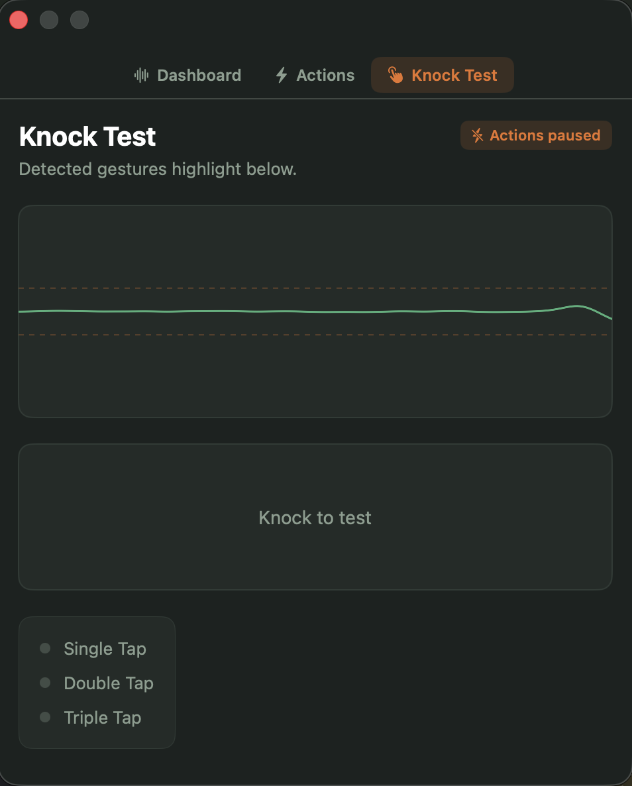

# Tapify

**The free, open-source alternative to [tryknock.com](https://www.tryknock.com).**

Tapify does exactly what tryknock.com does — lets you control your Mac by tapping on its chassis — except it costs nothing. No license fee, no subscription, no trial. Just download it, build it, and tap.

Every feature tryknock.com charges for is here for free: single, double, and triple tap gestures, Play/Pause, Lock Screen, Screenshot with crop, Open App, and Volume Up/Down.

> **Apple Silicon only (M1, M2, M3, M4). Does not work on Intel Macs.**

---

## Screenshots

<!-- Dashboard -->


<!-- Actions tab -->


<!-- Tap Test tab -->


---

## What It Does

Tapify listens to your MacBook's built-in accelerometer — the same motion sensor that protects your drive if you drop the laptop. When you tap the chassis, the sensor picks up the vibration. Tapify reads that signal and converts it into an action you've assigned.

You assign a different action to each gesture:

| Gesture | Example action |
|---|---|
| Single tap | Play / Pause |
| Double tap | Lock Screen |
| Triple tap | Take a Screenshot |

---

## Features

- **Single, double, and triple tap** — each gesture triggers a different action
- **Play / Pause** — works with Spotify, Apple Music, YouTube, anything
- **Lock Screen** — instantly sleeps your display
- **Screenshot with crop** — draw a region and save it to ~/Pictures
- **Open App** — launch any app installed on your Mac
- **Volume Up / Down** — nudges system volume by 7% per tap
- **Sensitivity slider** — adjust how hard or soft you need to tap
- **Tap speed** — choose Fast (600ms), Balanced (900ms), or Slow (1200ms)
- **Live waveform** — watch the sensor signal as you tap, in real time
- **Test mode** — test your taps without triggering any real actions
- **Menu bar app** — sits quietly in your menu bar, zero Dock clutter

---

## How It Works

Your MacBook's Apple Silicon chip has a MEMS accelerometer built in. It runs constantly in the background, originally designed to detect sudden drops and protect the storage drive.

Tapify reads raw data from that sensor at around 100 times per second using a macOS framework called **IOKit HID**. Here's what happens when you tap:

1. The Z-axis of the accelerometer spikes sharply above its resting baseline (gravity, ~1g)
2. Tapify compares that spike against a threshold you control with the sensitivity slider
3. A short lockout window (150ms) ignores any mechanical vibration after each tap
4. A gesture window (600–1200ms, based on your Tap Speed setting) groups taps together into a single / double / triple

Tilting or moving the laptop doesn't cause false triggers because Tapify continuously tracks the gravity baseline using an exponential moving average.

---

## Requirements

| | |
|---|---|
| Chip | Apple Silicon — M1, M2, M3, or M4 |
| macOS | Ventura 13 or later |
| Xcode | 15 or later |
| Homebrew | Needed to install the build tool (`xcodegen`) |

---

## Download & Run

### Step 1 — Install Homebrew (if you don't have it)

Open Terminal and paste:

```bash
/bin/bash -c "$(curl -fsSL https://raw.githubusercontent.com/Homebrew/install/HEAD/install.sh)"
```

Skip this step if you already have Homebrew.

### Step 2 — Clone the repo

```bash
git clone https://github.com/versacecrispies/Tapify.git
cd Tapify
```

### Step 3 — Run setup

```bash
./setup.sh
```

This will:
- Install `xcodegen` via Homebrew (if not already installed)
- Generate the Xcode project file
- Open the project in Xcode automatically

### Step 4 — Build and run

In Xcode, press **Cmd + R**.

Tapify will launch and appear in your **menu bar** (top-right of your screen). Click the icon to open the app.

---

## First Launch — Permissions

macOS will ask for two permissions the first time you use certain actions:

- **Accessibility** — required for Play/Pause (simulates a media key)
- **Screen Recording** — required for the Screenshot action

To grant them: **System Settings → Privacy & Security → Accessibility / Screen Recording**, then toggle Tapify on.

---

## Tips

- **Best place to tap:** the palm rest or the area just above the trackpad — these spots give the clearest vibration signal
- **Getting false triggers?** Drag the sensitivity slider to the left (less sensitive)
- **Taps not registering?** Drag the sensitivity slider to the right, or set Tap Speed to Slow
- **Not sure if it's working?** Open the Tap Test tab and tap — you'll see the waveform react without triggering any actions

---

## Project Structure

```
Tapify/
├── App/          # App entry point, AppDelegate, menu bar setup
├── HID/          # Reads the accelerometer via IOKit (Objective-C)
├── Detection/    # Tap detection logic (Swift)
├── Actions/      # Executes actions, handles screenshot cropping
├── Settings/     # Saves your preferences with UserDefaults
└── UI/           # All screens and visual components (SwiftUI)
```

---

## Contributing

Pull requests are welcome. For anything large, open an issue first so we can discuss the approach before you build it.

---

## License

MIT — free to use, modify, and ship.
